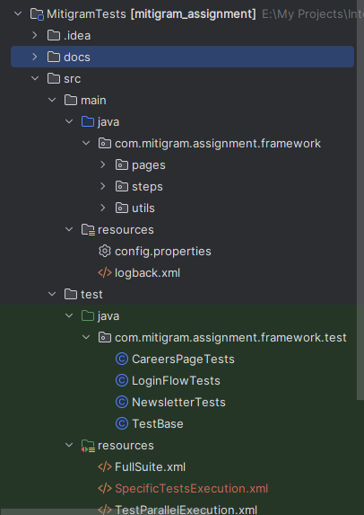

# Mitigram Assignment
## Introduction
This repository contains the Selenium test scenarios to test the Login flow of the Mitigram portal, the Careers page, and the Newsletter section.
## Supported Operating Systems
* Windows
* Linux
* Mac 
## Folder Structure
  
`com.mitigram.assignment.framework` is the root package of the core components of the framework.
### pages
This package contains the Page Classes following the 
Page Object Model (POM) design pattern.
### steps
This package contains the steps classes and these classes contain 
a set of methods that encapsulate specific interactions and validations 
related to the user interface. By using these methods, you can 
seamlessly create test cases for your automation suite.
### utils
This package contains the utility classes.
## Prerequisites
Following dependencies should be installed before build and run the test suite.
* Java 19 or above
* Maven 3.8.x and above
* Browser driver according to your browser version
## Check Java Installation
Run the command in a terminal
`java -version`. It should display the following output if you have installed java properly.  
`java version "21.0.1" 2023-10-17 LTS`  
`Java(TM) SE Runtime Environment (build 21.0.1+12-LTS-29)`  
`Java HotSpot(TM) 64-Bit Server VM (build 21.0.1+12-LTS-29, mixed mode, sharing)`
## Check Maven Installation
Run the command in terminal `mvn -v`. It should display the following output if you have installed maven properly.  
`Apache Maven 3.9.6 (bc0240f3c744dd6b6ec2920b3cd08dcc295161ae)`  
`Maven home: E:\My Projects\apache-maven-3.9.6` (The path can be different based on your installed location).  
`ava version: 21.0.1, vendor: Oracle Corporation, runtime: C:\Program Files\Java\jdk-21` (The path can be different based on your installed location).  
`Default locale: en_US, platform encoding: UTF-8`  
`OS name: "windows 10", version: "10.0", arch: "amd64", family: "windows"`
## Configure Test Suite (Before Run)
Open the file `src/main/resources/config.properties`.  
Update the Driver location
Ex: CHROME_DRIVER_LOCATION={@your path to chrome driver}\chromedriver.exe
## Build and Run Locally

#### Build Test Suite
Run the command `mvn clean install -DskipTests` in a terminal from the project root directory to build the project.
#### Execute Testcases
##### Execute Full Suite
Run the command `mvn test -Dtest.suite=FullSuite` 
in a terminal from the project root directory considering **FullSuite** is the name of the test suite xml file in `src/test/resources` Ex: **FullSuite.xml**.
##### Execute Full Suite parallel with two browsers. 
Run the command `mvn test -Dtest.suite=TestParallelExecution` 
in a terminal from the project root directory. You have to update the 
value attribute of the parameter tag in the 
`src/test/resources/TestParallelExecution.xml` file according to your browsers.
##### Execute specific test cases.
Run the command `mvn test -Dtest.suite=SpecificTestsExecution`
in a terminal from the project root directory. You have to update the value 
attribute of the parameter tag in the
`src/test/resources/SpecificTestsExecution.xml` file according to your browser and add required test cases inside the classes and methods tags. A few test cases have been added to the SpecificTestsExecution.xml file. Please change it according to your requirements.
##### View Test Results Report
Open the file `target/surefire-reports/index.html` in a web browser to view the HTML test results report.
##### View Test Logs
Open the file `target/logs/mitigram-selenium-test.log` to view the outputs logged to the file.

